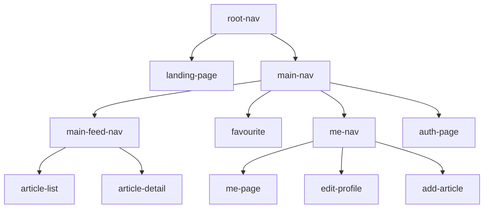

# Frontend

This document describes anything that LLM need to know about the frontend.

The frontend target Android, Desktop, and Web in both Kotlin/JS and Kotlin/wasmJs. iOS platform is not supported but gradle has already configured the iOS source set, and some codes for iOS is already written.

## Structure

The [`conduit-frontend`](./conduit-frontend) module is further divided into several modules as following:

- [`frontend-decompose-logic`](conduit-frontend\frontend-decompose-logic): The shared business logic and navigation logic implemented with Decompose and MVIKotlin.
- [`frontend-compose-ui`](conduit-frontend\frontend-compose-ui): The Compose UI implementation.
- [`app-android`](conduit-frontend\app-android): The Android app implementation.
- [`app-desktop`](conduit-frontend\app-desktop): The Desktop app implementation.
- [`app-web`](conduit-frontend\app-web): The Web app implementation.

## Decompose Logic

The decompose module serves as the business logic and the common navigation logic for the frontend. It is diagnosed to any UI framework despite currently only Compose UI is using it.

The whole decompose module is a tree:

Each node is either a component or a navigation node, with an exception of `me-nav` that is both a component and a navigation node.

### Navigation Node

A navigation node typically using one of the [Decompose routing](https://arkivanov.github.io/Decompose/navigation/overview/) like Child Stack, Child Panels, etc.

A navigation node sometimes can also have dependencies from the [service layer](..\conduit-frontend\frontend-decompose-logic\src\commonMain\kotlin\mikufan\cx\conduit\frontend\logic\service).

### Component Node

A component node is a class that implements the [MviComponent](..\conduit-frontend\frontend-decompose-logic\src\commonMain\kotlin\mikufan\cx\conduit\frontend\logic\component\util\MviComponent.kt) interface, it is implemented using [Decompose's ComponentContext](https://arkivanov.github.io/Decompose/component/overview/) and [MVIKotlin's store](https://arkivanov.github.io/MVIKotlin/store.html).

For component node, it is formed by three files. The models like state, intent, etc are saved in a file postfixed with `.model.kt`. the component class is saved in a file postfixed with `.component.kt`. Lastly the MVI store is saved in a file postfixed with `.store.kt`.

The MVI store usually will use some [service layer](..\conduit-frontend\frontend-decompose-logic\src\commonMain\kotlin\mikufan\cx\conduit\frontend\logic\service) classes to do the actual business work

### Navigation Node with Component Stuff

`me-nav` is the exception where it is both a component and a navigation node. It is in fact a navigation node, but the navigation is dynamic based on the user login state, which is expressed as a MVIKotlin store. Based on the state, the number of tabs in the navigation bar changes.
This exception works because there is a clear way to map the state into a tab navigation that implemented by using a Child Stack navigation.

## Compose UI

The structure of the UI is basically just following the tree structure of the decompose module. Usually each node in the tree in the decompose module will have a corresponding Composable function in the Compose module.

The Compose module contains some our own spacing and padding settings in [`LocalSpace`](conduit-frontend\frontend-compose-ui\src\commonMain\kotlin\mikufan\cx\conduit\frontend\ui\theme\Space.kt) composition local, when generating Compose UI code with layouts, always use the values from the `LocalSpace`, or a formula based on the values, instead of hardcoding the values

When using layout such as `Column`, `Row`, `LazyVerticalGrid`, etc, prefer to build-in parameters, such as  `verticalArrangement` and `horizontalArrangement` for `Column` for example, to specify the base spacing between the items. Then if you need to specify some custom spacing between two particular items, use the `LocalSpace` composition local to calculate the custom spacing and then put `Spacer` between the items.
