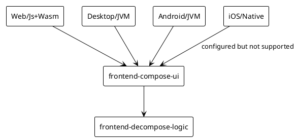

# Frontend

This document describes anything that LLM need to know about the frontend.

The frontend target Android, Desktop, and Web in both Kotlin/JS and Kotlin/wasmJs. iOS platform is not supported but gradle has already configured the iOS source set, and some codes for iOS is already written.

## Structure

The [`conduit-frontend`](../../conduit-frontend) module is further divided into several modules as following:

- [`frontend-decompose-logic`](../../conduit-frontend/frontend-decompose-logic): The shared business logic and navigation logic implemented with Decompose and MVIKotlin.
- [`frontend-compose-ui`](../../conduit-frontend/frontend-compose-ui): The Compose UI implementation.
- [`app-android`](../../conduit-frontend/app-android): The Android app implementation.
- [`app-desktop`](../../conduit-frontend/app-desktop): The Desktop app implementation.
- [`app-web`](../../conduit-frontend/app-web): The Web app implementation.

## Architecture Diagram

