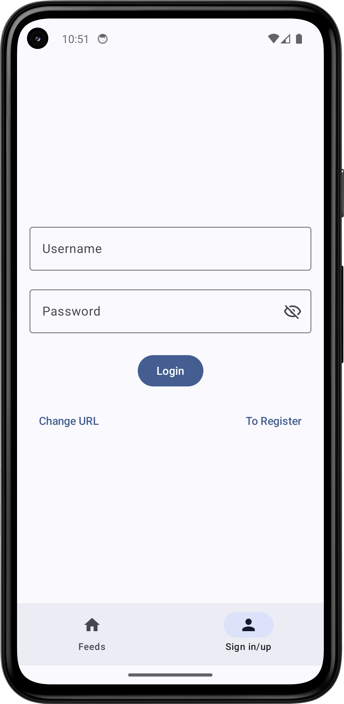

# 

> <h3>Compose Multiplatform + Decompose + MVIKotlin codebase containing real world examples (CRUD, auth, advanced patterns, etc) that adheres to the <a href="https://github.com/gothinkster/realworld">RealWorld</a> spec and API. </h3>

| Phone | Desktop | Web|
|---|---|---|
|  |  Click to enlarge |  Click to enlarge |

This codebase was created to demonstrate a minimal frontend application built with **[Compose Multiplatform](https://www.jetbrains.com/lp/compose-multiplatform/)** and **[Decompose](https://arkivanov.github.io/Decompose/)** and **[MVIKotlin](https://arkivanov.github.io/MVIKotlin/)**, including CRUD operations, authentication, routing, pagination, and more.

We've gone to great lengths to adhere to the community styleguides & best practices of **Compose Multiplatform**, **Decompose** and **MVIKotlin**.

For more information on how this works with other frontends/backends, head over to the [RealWorld](https://github.com/gothinkster/realworld) repo.

This project was initially a full task project, but due to the reason mentioned in [this discussion](https://github.com/gothinkster/realworld/discussions/1545#discussioncomment-10984982), it was decided to scale down to a minimal frontend application. However, the gradle setup of the project is still kept as it was a fullstack project. It is also the most sophisticated gradle setup I have ever done, so I decided to keep it as is.

## Documentation

Head over to the [`common-doc`](common-doc) folder for documentation.

The documentation is served as both a guide for human contributors, and a prompt for LLMs.
