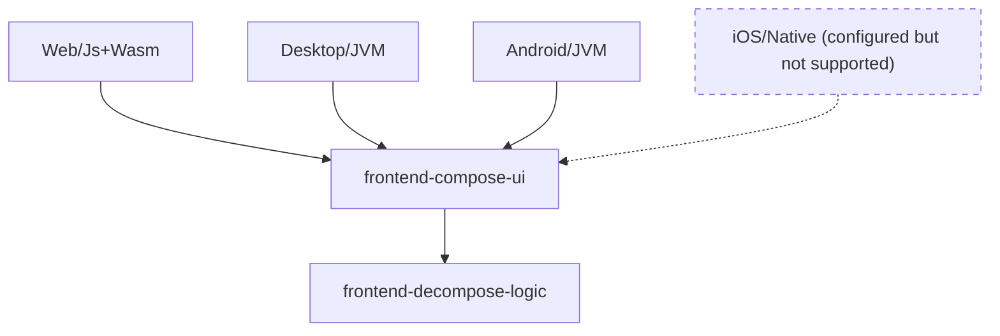

# Frontend

For Human Contributors: You need to follow this [guide](https://www.jetbrains.com/help/kotlin-multiplatform-dev/multiplatform-setup.html#check-your-environment) to set up the Compose Multiplatform development environment.

The frontend target Android, Desktop, and Web in both Kotlin/JS and Kotlin/wasmJs. iOS platform is not supported but gradle has already configured the iOS source set, and some codes for iOS is already written.

## Structure

The [`conduit-frontend`](../../conduit-frontend) module is further divided into several modules as following:

- [`frontend-decompose-logic`](../../conduit-frontend/frontend-decompose-logic): The shared business logic and navigation logic implemented with Decompose and MVIKotlin.
- [`frontend-compose-ui`](../../conduit-frontend/frontend-compose-ui): The Compose UI implementation.
- [`app-android`](../../conduit-frontend/app-android): The Android app implementation.
- [`app-desktop`](../../conduit-frontend/app-desktop): The Desktop app implementation.
- [`app-web`](../../conduit-frontend/app-web): The Web app implementation.

## Architecture Diagram

## About Testing

`conduit-frontend` contains multiplatform tests that run on all 4 platforms. However, tests on the JS and Wasm platform require a browser, so far `useChromiumHeadless()` is defined in [`kmp-library.gradle.kts`](build-src/plugins/multiplatform-library/src/main/kotlin/my/kmp-library.gradle.kts), which means you need to install Chromium/Chrome for running tests on the JS platform. If you have another browser, feel free to change to `useFirefox()` (or any other browser supported by Karma) for your convenience.
