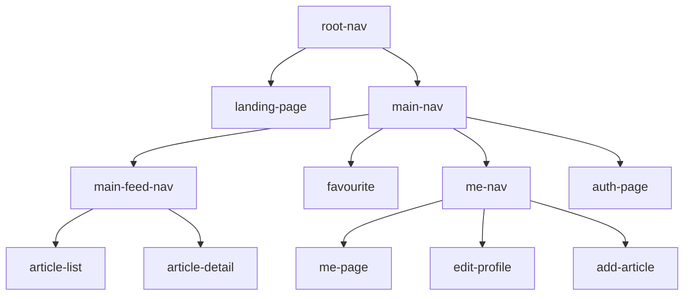

# Decompose Logic

The decompose module serves as the business logic and the common navigation logic for the frontend. It is diagnosed to any UI framework despite currently only Compose UI is using it.

The whole decompose module is a tree:



Each node is either a component or a navigation node, with an exception of `me-nav` that is both a component and a navigation node.

## Component Node

A component node is a class that implements the [MviComponent](../../conduit-frontend/frontend-decompose-logic/src/commonMain/kotlin/mikufan/cx/conduit/frontend/logic/component/util/MviComponent.kt) interface, it is implemented using [Decompose's ComponentContext](https://arkivanov.github.io/Decompose/component/overview/) and [MVIKotlin's store](https://arkivanov.github.io/MVIKotlin/store.html).

For component node, it is formed by three files. The models like state, intent, etc are saved in a file postfixed with `.model.kt`. the component class is saved in a file postfixed with `.component.kt`. The component class does not handle the MVI, but rather delegates it to the MVI store, that is saved in a file postfixed with `.store.kt`.

The MVI store usually will use some [service layer](../../conduit-frontend/frontend-decompose-logic/src/commonMain/kotlin/mikufan/cx/conduit/frontend/logic/service) classes to do the actual business work

## Navigation Node

A navigation node typically using one of the [Decompose routing](https://arkivanov.github.io/Decompose/navigation/overview/) like Child Stack, Child Panels, etc. They are usually implemented in a single file postfixed with `.component.kt`, early implementation may named different with something include "Nav".

A navigation node sometimes can also have dependencies from the [service layer](../../conduit-frontend/frontend-decompose-logic/src/commonMain/kotlin/mikufan/cx/conduit/frontend/logic/service).

## Navigation Node with Component Stuff

`me-nav` is the exception where it is both a component and a navigation node. It is in fact a navigation node, but the navigation is dynamic based on the user login state, which is expressed as a MVIKotlin store. Based on the state, the number of tabs in the navigation bar changes. Also, user switching tab is traded as an intent, which perfectly fit the MVI pattern.

Hence `me-nav` can be both a component and a navigation node, because there is a clear way to map the state into a tab navigation that implemented by using a Child Stack navigation.

## Setup of the Navigation Tree

Each node (navigation or component) has a factory class. The factory class itself is a singleton, very suitable to be registered in any DI container (in our stack, it is Koin).

In the Factory class constructor are dependencies that the created component needs. Usually they are dependencies from the [service layer](../../conduit-frontend/frontend-decompose-logic/src/commonMain/kotlin/mikufan/cx/conduit/frontend/logic/service), or other factory classes such as factory classes of child nodes or the MVI store factory.

The factory class only contains one method, usually named `create`. Parameters on that method are data that needed to be passed from the parent node to the child node. Some examples include navigation callback from parent navigation node, or data that needed to be passed from parent component to child component. More examples can checkout `MePageComponentFactory` at [`Me.component.kt`](../../conduit-frontend/frontend-decompose-logic/src/commonMain/kotlin/mikufan/cx/conduit/frontend/logic/component/main/me/Me.component.kt)

Btw, MVIKotlin store itself are already declared as a factory class, following the similar pattern.

## MVIKotlin Store Testing

The decompose-logic module contains comprehensive test coverage for all MVIKotlin stores. The tests follow consistent patterns and conventions that should be used when writing new store tests.

### Test Class Structure and Setup

**Naming Convention**: Test classes are named after the store they test with a `Test` suffix (e.g., `LandingPageStoreTest`).

**Core Components**: Each test class declares:

- A `StandardTestDispatcher` for controlling coroutine execution
- Mocked service dependencies
- The store being tested

```kotlin
class LandingPageStoreTest {
  private val testDispatcher = StandardTestDispatcher()
  
  lateinit var landingService: LandingService
  lateinit var landingPageStore: Store<LandingPageIntent, LandingPageState, LandingPageLabel>
}
```

**Setup Pattern**: The `@BeforeTest` method follows this pattern:

1. Mock service dependencies using `dev.mokkery`
2. Create store using its factory
3. Inject mocked services and test dispatcher
4. Wrap `DefaultStoreFactory` with `LoggingStoreFactory` for debugging

```kotlin
@BeforeTest
fun setUp() {
  landingService = mock()
  landingPageStore = LandingPageStoreFactory(
    LoggingStoreFactory(DefaultStoreFactory()),
    landingService,
    testDispatcher
  ).createStore()
}
```

**Cleanup**: Store cleanup **MUST** be done inside `runTest()` to prevent `UncompletedCoroutinesError`. Do NOT use `@AfterTest` as it executes outside the test coroutine scope:

```kotlin
@Test
fun testStoreOperation() = runTest(testDispatcher) {
  // ... test logic ...
  
  // Always dispose resources before runTest completes
  disposable.dispose() // if using state/label observers
  landingPageStore.dispose() // CRITICAL: prevents test leakage
}
```

**❌ Incorrect Pattern (causes UncompletedCoroutinesError):**
```kotlin
@AfterTest
fun reset() {
  landingPageStore.dispose() // Wrong! Outside runTest scope
}
```

### Dependency Mocking with Mokkery

**Library**: Use `dev.mokkery` exclusively for mocking.

**Creating Mocks**: Use `mock()` to create service mocks:

```kotlin
landingService = mock()
```

**Stubbing Suspend Functions**:

- Success: `everySuspend { service.method(any()) } returns result`
- Failure: `everySuspend { service.method(any()) } throws Exception("error")`

```kotlin
// Success case
everySuspend { 
  articlesListService.getArticles(defaultSearchFilter, offset = 0) 
} returns testArticles

// Failure case  
everySuspend { 
  landingService.checkAccessibilityAndSetUrl(any()) 
} throws Exception("some error")
```

**Stubbing Regular Functions/Flows**: Use `every { ... } returns ...` for non-suspend functions:

```kotlin
every { mePageService.userConfigFlow } returns flowOf(UserConfigState.OnLogin("test-url", userInfo))
```

**Verification**: Use `verifySuspend` with `VerifyMode.exactly(1)` to assert method calls:

```kotlin
verifySuspend(exactly(1)) {
  landingService.checkAccessibilityAndSetUrl("a change")
}
```

### State Change Testing

**Test Runner**: Use `runTest(testDispatcher)` for all coroutine-based tests.

**State Observation Pattern**: Use `Channel` to observe state changes sequentially:

```kotlin
@Test
fun testStateChange() = runTest(testDispatcher) {
  val stateChannel = Channel<ArticlesListState>()
  
  val disposable = articlesListStore.states(observer(onNext = { 
    this.launch { stateChannel.send(it) } 
  }))
  
  // Ignore initial state if not relevant
  stateChannel.receive()
  
  // Send intent
  articlesListStore.accept(ArticlesListIntent.LoadMore)
  
  // Assert state transitions
  val loadingState = stateChannel.receive()
  assertEquals(LoadMoreState.Loading, loadingState.loadMoreState)
  
  val loadedState = stateChannel.receive()
  assertEquals(testArticles, loadedState.collectedThumbInfos)
  
  disposable.dispose()
}
```

**Direct State Access**: For simple synchronous changes, access state directly:

```kotlin
authPageStore.accept(AuthPageIntent.UsernameChanged("new username"))
assertEquals(authPageStore.state.username, "new username")
```

### Label Testing

**Primary Pattern**: Use `store.labelsChannel(scope)` with separate `TestScope`:

```kotlin
@OptIn(ExperimentalMviKotlinApi::class)
@Test
fun testLabel() = runTest(testDispatcher) {
  val testScope = TestScope(testDispatcher)
  val labelsChannel = landingPageStore.labelsChannel(testScope)
  
  landingPageStore.accept(LandingPageIntent.CheckAndMoveToMainPage)
  
  val label = labelsChannel.receive()
  assertEquals(LandingPageLabel.ToNextPage, label)
  
  testScope.cancel() // Critical for test completion
}
```

**Important**: Always use a separate `TestScope` for `labelsChannel` to prevent deadlocks with `runTest`. Cancel the scope at the end of the test.

### Error Handling Patterns

**Simulating Errors**: Stub service methods to throw exceptions:

```kotlin
val errorMessage = "Failed to load articles" 
everySuspend {
  articlesListService.getArticles(any(), offset = any())
} throws RuntimeException(errorMessage)
```

**Testing Error State**: If errors update the store state:

```kotlin
landingPageStore.accept(LandingPageIntent.CheckAndMoveToMainPage)

val newState = stateChannel.receive()
assertEquals(errorMessage, newState.errorMsg)
```

**Testing Error Labels**: If errors are communicated via labels:

```kotlin
val failureLabel = labelChannel.receive()
assertIs<LandingPageLabel.Failure>(failureLabel)
assertEquals("some error", failureLabel.message)
assertTrue(failureLabel.exception is RuntimeException)
```

### Async/Coroutine Management

**Test Dispatcher**: Always use `StandardTestDispatcher` for predictable coroutine execution:

```kotlin
private val testDispatcher = StandardTestDispatcher()
```

**Test Runner**: Use `runTest(testDispatcher)` for controlled async execution:

```kotlin
@Test
fun myTest() = runTest(testDispatcher) {
  // test code
}
```

**Scope Management**: Use `TestScope` for managing coroutine lifecycles, especially for `labelsChannel`:

```kotlin
val testScope = TestScope(testDispatcher)
val labelsChannel = store.labelsChannel(testScope)
// ... test logic ...
testScope.cancel()
```

### Common Test Utilities and Best Practices

**Required Dependencies**:

- `kotlinx-coroutines-test` for `StandardTestDispatcher`, `TestScope`, and `runTest`
- `com.arkivanov.mvikotlin.extensions.coroutines` for `labelsChannel`
- `dev.mokkery` for mocking
- `kotlinx.coroutines.channels.Channel` for state observation

**LoggingStoreFactory**: Always wrap `DefaultStoreFactory` with `LoggingStoreFactory` for better debugging:

```kotlin
LandingPageStoreFactory(
  LoggingStoreFactory(DefaultStoreFactory()),
  landingService,
  testDispatcher
).createStore()
```

**Resource Cleanup**: Always dispose of resources INSIDE `runTest()` scope:

- Call `store.dispose()` at the end of each test method (NOT in `@AfterTest`)
- Call `disposable.dispose()` for state observers before `store.dispose()`
- Cancel `TestScope` instances

**Correct Order:**
```kotlin
@Test
fun myTest() = runTest(testDispatcher) {
  // ... test logic ...
  
  disposable.dispose()      // First: dispose observers
  testScope.cancel()        // Second: cancel scopes  
  store.dispose()          // Last: dispose store
}
```

**Test Data**: Define test data as properties for reuse across test methods:

```kotlin
private val testArticles = listOf(
  ArticleInfo(
    authorThumbnail = "https://example.com/avatar.png",
    authorUsername = "testuser",
    title = "Test Article",
    // ... other properties
  )
)
```

### Bootstrapper Testing

**AutoInit Parameter**: Stores with bootstrappers require special handling during testing to control when the bootstrapper starts.

**Pattern**: Store factory methods should accept an `autoInit: Boolean = true` parameter:

```kotlin
fun createStore(autoInit: Boolean = true) = storeFactory.create(
  name = "MyStore",
  initialState = MyState.initial(),
  bootstrapper = createBootstrapper(),
  executorFactory = executor,
  reducer = reducer,
).apply {
  if (autoInit) init()
}
```

**Usage in Tests**: Always pass `autoInit = false` in tests to control bootstrapper timing:

```kotlin
@BeforeTest
fun setUp() {
  myService = mock()
  myStore = MyStoreFactory(
    LoggingStoreFactory(DefaultStoreFactory()),
    myService,
    testDispatcher,
  ).createStore(autoInit = false) // Prevents automatic bootstrapper start
}
```

**Manual Initialization**: Call `store.init()` when ready to test bootstrapper behavior:

```kotlin
@Test
fun testBootstrapperFlow() = runTest(testDispatcher) {
  // Setup mocks first
  every { myService.someFlow } returns flowOf(expectedValue)
  
  // Start bootstrapper manually
  myStore.init()
  
  // Test the resulting state changes
  // ...
}
```

**Why This Pattern is Necessary**: Without `autoInit = false`, the bootstrapper immediately starts executing when the store is created, potentially:
- Dispatching actions before test setup is complete
- Causing race conditions with mock setup
- Making tests unpredictable and hard to debug

These patterns ensure consistent, reliable, and maintainable tests for all MVIKotlin stores in the decompose-logic module.
