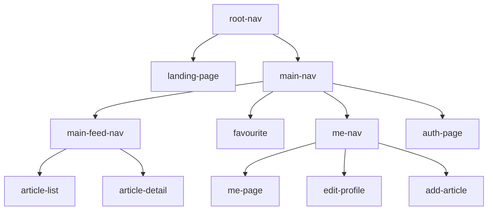

# Decompose Logic

The decompose module serves as the business logic and the common navigation logic for the frontend. It is diagnosed to any UI framework despite currently only Compose UI is using it.

The whole decompose module is a tree:

Each node is either a component or a navigation node, with an exception of `me-nav` that is both a component and a navigation node.

## Component Node

A component node is a class that implements the [MviComponent](../../conduit-frontend/frontend-decompose-logic/src/commonMain/kotlin/mikufan/cx/conduit/frontend/logic/component/util/MviComponent.kt) interface, it is implemented using [Decompose's ComponentContext](https://arkivanov.github.io/Decompose/component/overview/) and [MVIKotlin's store](https://arkivanov.github.io/MVIKotlin/store.html).

For component node, it is formed by three files. The models like state, intent, etc are saved in a file postfixed with `.model.kt`. the component class is saved in a file postfixed with `.component.kt`. The component class does not handle the MVI, but rather delegates it to the MVI store, that is saved in a file postfixed with `.store.kt`.

The MVI store usually will use some [service layer](../../conduit-frontend/frontend-decompose-logic/src/commonMain/kotlin/mikufan/cx/conduit/frontend/logic/service) classes to do the actual business work

## Navigation Node

A navigation node typically using one of the [Decompose routing](https://arkivanov.github.io/Decompose/navigation/overview/) like Child Stack, Child Panels, etc. They are usually implemented in a single file postfixed with `.component.kt`, early implementation may named different with something include "Nav".

A navigation node sometimes can also have dependencies from the [service layer](../../conduit-frontend/frontend-decompose-logic/src/commonMain/kotlin/mikufan/cx/conduit/frontend/logic/service).

## Navigation Node with Component Stuff

`me-nav` is the exception where it is both a component and a navigation node. It is in fact a navigation node, but the navigation is dynamic based on the user login state, which is expressed as a MVIKotlin store. Based on the state, the number of tabs in the navigation bar changes. Also, user switching tab is traded as an intent, which perfectly fit the MVI pattern.

Hence `me-nav` can be both a component and a navigation node, because there is a clear way to map the state into a tab navigation that implemented by using a Child Stack navigation.

## Setup of the Navigation Tree

Each node (navigation or component) has a factory class. The factory class itself is a singleton, very suitable to be registered in any DI container (in our stack, it is Koin).

In the Factory class constructor are dependencies that the created component needs. Usually they are dependencies from the [service layer](../../conduit-frontend/frontend-decompose-logic/src/commonMain/kotlin/mikufan/cx/conduit/frontend/logic/service), or other factory classes such as factory classes of child nodes or the MVI store factory.

The factory class only contains one method, usually named `create`. Parameters on that method are data that needed to be passed from the parent node to the child node. Some examples include navigation callback from parent navigation node, or data that needed to be passed from parent component to child component. More examples can checkout `MePageComponentFactory` at [`Me.component.kt`](../../conduit-frontend/frontend-decompose-logic/src/commonMain/kotlin/mikufan/cx/conduit/frontend/logic/component/main/me/Me.component.kt)

Btw, MVIKotlin store itself are already declared as a factory class, following the similar pattern.
